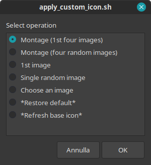
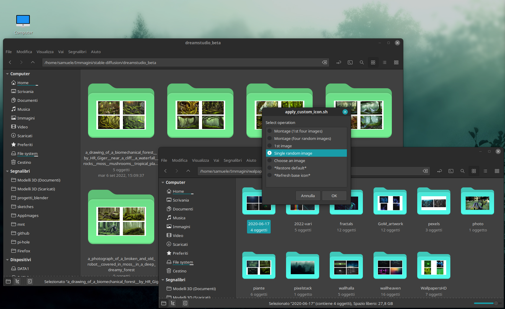
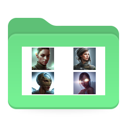
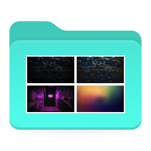
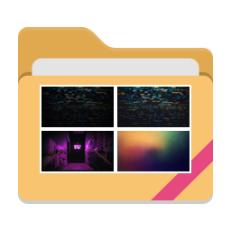

Apply Custom Icon
==============

Nemo action to apply a custom composed icon based on images contained in the selected folder

<p align="center">
  
  
  
</p>

## INSTALLATION
The script requires: xdotool zenity yad convert montage rsvg-convert   
On Linux Mint (I have latest 21.1 Vera) and similar distros, you can verify that you have all the dependencies with:
`sudo apt install zenity yad graphicsmagick-imagemagick-compat librsvg2-bin`

To install, open a terminal and do:
```
cd ~/.local/share/nemo/actions/
curl -OO https://raw.githubusercontent.com/dentex/apply_custom_icon/main/scripts/apply_custom_icon.{nemo_action,sh}
```

## OPERATIONS
4+2 types of operation are available:

### Multiple images:
- *Montage (1st four images)*   
 Picks the **first four** images found in the selected folder(s).
- *Montage (four random images)*   
 Picks the **four random** images found in the selected folder(s).

|  |
|------------------------------------|
 
### Single image:
- *1st image*   
 Picks the first image available into the folder(s)
- *Single random image*   
 Picks a random image from the folder(s)
- *Choose an image*   
 Uses a file selector for manually picking the image to be composed, for every selected folder.

|  |
|------------------------------------|
 
### Other operations:
- *Restore default*   
 Restore the default theme's folder icon for every selected folder.

| | ==>|  |
|----------------------------|----|-----------------------------|
 
- *Refresh base icon*   
 Updates the already composed icon(s) with the current theme's default folder as background.

| | ==> |  |
|----------------------------|-----|-----------------------------|
 
